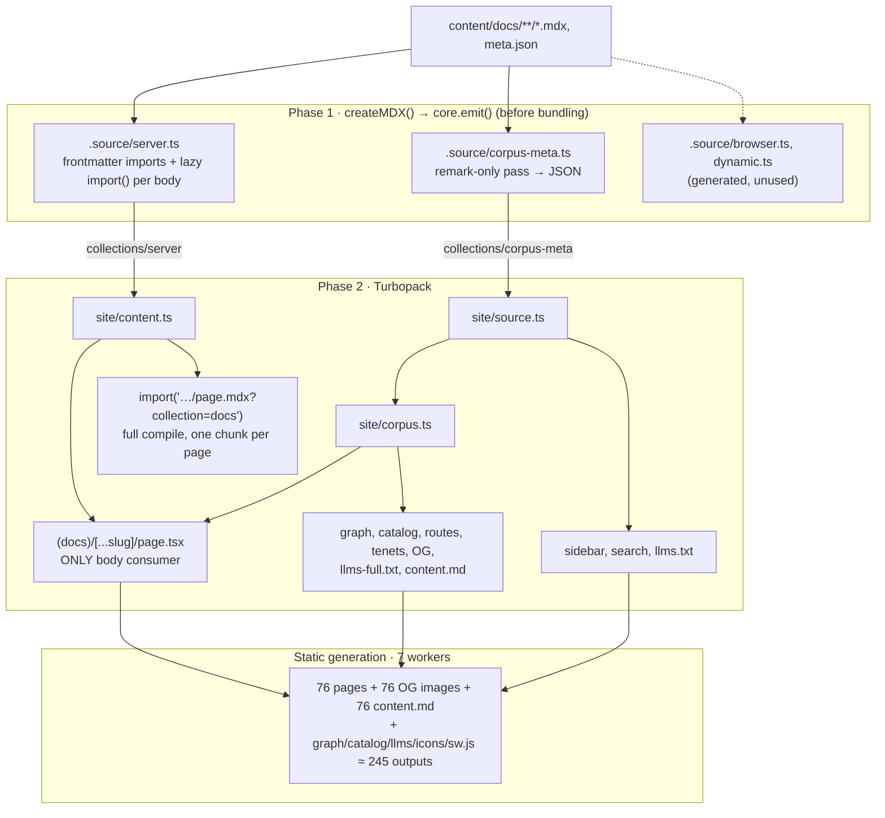

# Compilation Architecture

The site compiles **page metadata and page bodies separately**. They come from the same MDX files and the same remark plugins, but they are produced by two independent compile paths.


|                 | Metadata (corpus-meta)                                                          | Bodies                            |
| --------------- | ------------------------------------------------------------------------------- | --------------------------------- |
| **What**        | frontmatter, math environments (`envs`), search index, link graph               | rendered MDX, KaTeX, Shiki, TOC   |
| **Compiled by** | custom fumadocs plugin, before bundling                                         | the bundler (fumadocs MDX loader) |
| **Pipeline**    | remark only                                                                     | remark → rehype → recma → JS      |
| **Output**      | one JSON module, `.source/corpus-meta.ts` (~1.75 MB)                            | one lazy chunk per page           |
| **Read by**     | sidebar, search, graph, catalog, OG images, `llms*.txt`, `content.md`, terminal | `(docs)/[...slug]/page.tsx` only  |


The goal is that only the route that renders a page body pays for compiling and
loading it. Everything else works from a small, cheap, precomputed index.



## Design choices and their effect on compilation

### 1. Metadata is compiled in phase 1, not by the bundler

`src/lib/site/corpus-meta/plugin.ts` is a fumadocs-mdx plugin (`plugins: [corpusMeta()]` in `source.config.ts`). Its `emit` hook runs when Next loads
`next.config.mjs`, before Turbopack starts, and writes `.source/corpus-meta.ts`.

**Effect:** by the time bundling begins, every non-body consumer already has a
plain data module to import. The bundler never has to compile an MDX page just to
learn its title, its theorems, or its links.

Failure handling depends on the mode. In production a broken page throws and
fails the build. In dev the plugin emits a module that throws at import time
instead, so the dev server stays up and shows the error.

### 2. The metadata pass is remark-only

`generate.ts` builds an `@mdx-js/mdx` processor with `rehypePlugins: []` and
`recmaPlugins: []`. It runs `remarkInclude`, then the **resolved** remark plugins
(the fumadocs preset plus `remarkMath`, `remarkMdxMermaid`, `remarkMathEnv`), then
`remarkCapture`, which copies what the other plugins left on `file.data`:

- `envs` from `remarkMathEnv`: environment occurrences, recalls, and prose segments
- `structuredData` from fumadocs' `remarkStructure`: the search index
- `extractedReferences`: every link href, used for graph edges

**Effect:** the expensive steps (KaTeX rendering, Shiki highlighting, JS codegen)
never run for metadata. That's why a second pass over the corpus stays cheap.

### 3. Both paths share one set of remark plugins

Corpus-meta doesn't keep its own plugin list. `resolveMdxOptions` reads the same
options the bundler uses (`applyMdxPreset(...)("bundler")`), and
`core.transformFrontmatter` applies the same zod schema.

**Effect:** metadata and bodies can't drift apart through configuration. A new
remark plugin in `source.config.ts` automatically runs in both paths.

### 4. Bodies are lazy (`docs.async: true`)

With `async: true`, fumadocs generates `.source/server.ts` as a lazy collection:

```ts
import { frontmatter as __fd_glob_13 } from "../content/docs/algebra/index.mdx?collection=docs&only=frontmatter"
…
export const docs = await create.docsLazy("docs", "content/docs", { …meta.json… }, { …frontmatter… }, {
  "algebra/index.mdx": () => import("../content/docs/algebra/index.mdx?collection=docs"),
  …
});
```

- `?only=frontmatter` imports only parse and validate YAML. No remark or rehype
runs.
- `() => import(…)` is the full compile. Turbopack gives each page its own chunk
(`.next/server/chunks/ssr/content_docs_…_mdx_*.js`).

**Effect:** a body is compiled and evaluated only when something calls
`entry.load()`. The only caller is `loadPageContent` in `src/lib/site/content.ts`,
and the only importer of that module is the docs page. That's why the docs page is
the only route whose trace includes body chunks.

### 5. The fumadocs loader is built from corpus-meta, not from `collections/server`

`src/lib/site/source.ts` builds `loader()` from **virtual files** made out of
corpus-meta. `page.data` is frontmatter + `envs` + `structuredData` +
`extractedReferences`.

**Effect:** `source.getPageTree()`, `createFromSource(source)` and every other
fumadocs API work without importing a single MDX module. Search, the sidebar and
`llms.txt` stay free of bodies even though they use the standard fumadocs APIs.

### 6. Derived data is computed once per worker

`getCorpus()` in `src/lib/site/corpus.ts` builds the page index, kind views,
catalog, routes, graph and tenet index. It's memoised per process in production
(`memoInProduction`) and wrapped in React `cache` in dev.

**Effect:** static generation runs in 7 workers. Each builds the corpus once, and
every page, OG image and `content.md` in that worker reuses it.

### 7. Non-body exports are rebuilt from remark output

`content.md` and `llms-full.txt` (`export-page.ts`) are rebuilt from
`envs.segments`. `remarkMathEnv` serialises prose back to markdown at compile time,
so exporting a page never needs its compiled body. OG images use the title,
description, `ideas` and an environment census from `envs`.

### 8. Short markdown strings skip MDX entirely

Titles, descriptions, env statements, search previews and sidebar labels are short
markdown strings that can contain `$…$`. They go through a small pipeline in
`src/lib/markdown/` instead of MDX:

- `parse.ts`: micromark + gfm + math → mdast
- `render.ts`: `toHast` → optional search highlighting → `sanitize` → inline mode
(`toPhrasingRoot`) → `applyKatex` → HTML string
- `plain.ts`: plain text for `<title>`, aria labels and aliases
- `fragment.ts`: `compileMarkdownFragment` returns `{ source, html, plain }`

`parse`, `render` and `plain` share a 512-entry LRU (`cache.ts`). **Effect:** a
title shown in the sidebar, catalog, page header and metadata is KaTeX-rendered
once per worker, not four times.

### 9. Only canonical pages are prerendered

`/[...slug]`, `/og/docs/[...slug]/image.png` and
`/llms.mdx/docs/[[...slug]]/content.md` each use `generateStaticParams` →
`docsStaticParams(suffix)` with `revalidate = false`. That's 76 of each.

Kind-view URLs (e.g. `/algebra/eigenvalues/theorems`) and their OG images and
`content.md` files are **not** prerendered. `dynamicParams = true` renders them on
first request, and `revalidate = false` caches them forever.

**Effect:** the number of static outputs grows with the page count, not with pages
× kinds.

### 10. Client data is split by when it's needed

The docs layout renders client components (sidebar, terminal, graph) that need
course data. Their props are serialised into the RSC payload, which is inlined
into every prerendered page, so the data is split in two:

- **Render time:** `routes` (`src/lib/course/routes.ts`): page URLs and each
  page's kind views, about 10 KB. `(docs)/layout.tsx` passes it to
  `CourseRoutesProvider`; it drives the current page, sidebar sections and
  kind-view tree entries.
- **Interaction time:** the full catalog (titles, descriptions, aliases) and the
  graph document, served as static JSON (`/catalog.json`, `/graph-data.json`) and
  loaded once per page load with `jsonResource` (`src/lib/client/resource.ts`).

**Effect:** each page carries about 10 KB of course data instead of about
400 KB, and the JSON is downloaded once, then served from the HTTP cache or the
service worker.

### 11. The service worker is built by a route handler

`src/app/serwist/[path]/route.ts` (`createSerwistRoute`) is a static route. During
static generation it globs `.next/static/**/*.{js,css,woff2}`, injects the list
into `src/app/sw.ts` as `self.__SW_MANIFEST`, and bundles the worker with
esbuild into `/serwist/sw.js`. `/~offline` is added with `BUILD_REVISION` as
its revision: a UUID that `next.config.mjs` generates once per build and inlines
through `env`. It can't be the commit SHA, because a build with uncommitted
changes would keep serving the old offline page, and it can't be read from
`.next/BUILD_ID`, because route modules are first evaluated while collecting
page data, before that file is written.

**Effect:** the worker ships with this build's exact list of hashed assets and
is rebuilt on every build without a separate step. It is type-checked on its own
(`tsconfig.sw.json`; the main `tsconfig.json` excludes it). Runtime behaviour is
in [PWA.md](PWA.md).

## Intentional limitations

Each one is either due to the split architecture or something that isn't worth optimising.

### Remark runs twice per page

Every page goes through remark once in corpus-meta and again in the bundler.

**Why it's accepted:** parsing to mdast and running remark plugins is the cheap
part of compiling MDX. The expensive rehype and recma work (KaTeX, Shiki, codegen)
still runs only once, in the bundler. Merging the two passes would mean pulling
metadata out of the bundler's compile, which would couple every non-body consumer
back to the body pipeline. Avoiding that coupling is the reason the split exists.

**What it costs:** both runs must produce the same `envs` (see
[What would break the split](#what-would-break-the-split)), and every remark
plugin's cost is paid twice.

### Corpus-meta has no cache

Every build, and in dev every content save (100 ms debounce), re-processes **all**
76 pages, not just the one that changed.

**Why it's accepted:** a remark-only pass over 76 pages takes milliseconds. A
per-file cache would bring invalidation risk for almost no gain. For example, a
content hash of the MDX file misses an edit to a remark plugin that leaves the MDX
unchanged, and corpus-meta would silently serve stale `envs`.

**What it costs:** dev regeneration and build time grow linearly with the corpus,
and any slow remark plugin makes every save slower.

### Rehype output isn't available outside the docs page

Corpus-meta stops before rehype, so `toc` (from `rehypeToc`), rendered KaTeX and
highlighted code only exist in body chunks. A non-page route that needs one of
these has to get equivalent data from a remark plugin.

### Exactly one docs collection

`getDocsCollection` throws unless `source.config.ts` defines exactly one
`defineDocs` collection. Corpus-meta, `source.ts` and `content.ts` all assume a
single corpus.

## What would break the split

These don't fail loudly. The build still succeeds, but it gets slower, a bundle
gets bigger, or metadata quietly disagrees with bodies.

### Bundle boundaries

1. Importing `@/lib/site/content` or `collections/server` anywhere other than the
  docs page. That route would trace all 76 body chunks. Calling  `loadPageContent` 
  in a loop (e.g. in `llms-full.txt`) would evaluate every compiled body during 
  the build. If a new consumer needs something from the body, add it to corpus-meta instead.
2. Setting `docs.async: false`. fumadocs would import every compiled body eagerly 
  into `collections/server`, and `entry.load()` in `content.ts` would no longer exist.
3. Importing `source` or `corpus` from a `"use client"` component. That ships the 
  ~1.75 MB JSON to the browser. Pass render-time data as props, the way
  `(docs)/layout.tsx` passes `routes`, and serve the rest as static JSON.
4. Passing large data as layout props. It is serialised into every prerendered
  page: the full catalog as props added ~400 KB to each of the 76 pages. Keep
  props to what the first render needs; anything used only on interaction
  belongs in a JSON route loaded with `jsonResource`, listed in `DATA_ROUTES` in
  `sw.ts` so it works offline.
5. Importing anything that isn't worker-safe into `sw.ts`. esbuild bundles
  whatever it imports, so React, DOM or `server-only` code fails in the worker or
  bloats it. It imports `src/lib/site/config.ts` and `src/lib/pwa/protocol.ts`
  by relative path; keep both free of React, DOM and server imports.

### Metadata/body consistency

1. **Making the two remark runs disagree.** `envs` comes from corpus-meta, but the
  body's `<KindFilter>` and env components come from the bundler run. Plugins must
   be deterministic. Since both paths use the same resolved options, this only
   breaks if a plugin branches on the environment (e.g. `environment ===  "bundler"`) or depends on global state.
2. **Adding a `file.data.`* field without wiring it through.** It must be captured
  in `remarkCapture` (`generate.ts`), typed in `CorpusMetaPage` (`types.ts`), and
   mapped in `source.ts`. Skip any of the three and it silently never reaches
   `page.data`.
3. **Needing rehype-only data in a non-page route.** See the limitation above. The
  fix is a remark plugin, not a call to `loadPageContent`.

### Performance

1. **Slow remark plugins.** They run twice per page, once before bundling. In dev
  they also re-run over every page on every save. A plugin that does I/O (e.g.
   `remarkImage` fetching remote image sizes) would slow down builds and dev
   saves.
2. **Uncached `getCorpus()` work.** Anything expensive derived from the corpus
  belongs inside the memoised `getCorpus()`, not in a route handler, or it runs
   once per output instead of once per worker.
3. **Prerendering kind views.** Adding them to `generateStaticParams` multiplies
  static outputs (and OG images) by the number of kinds.