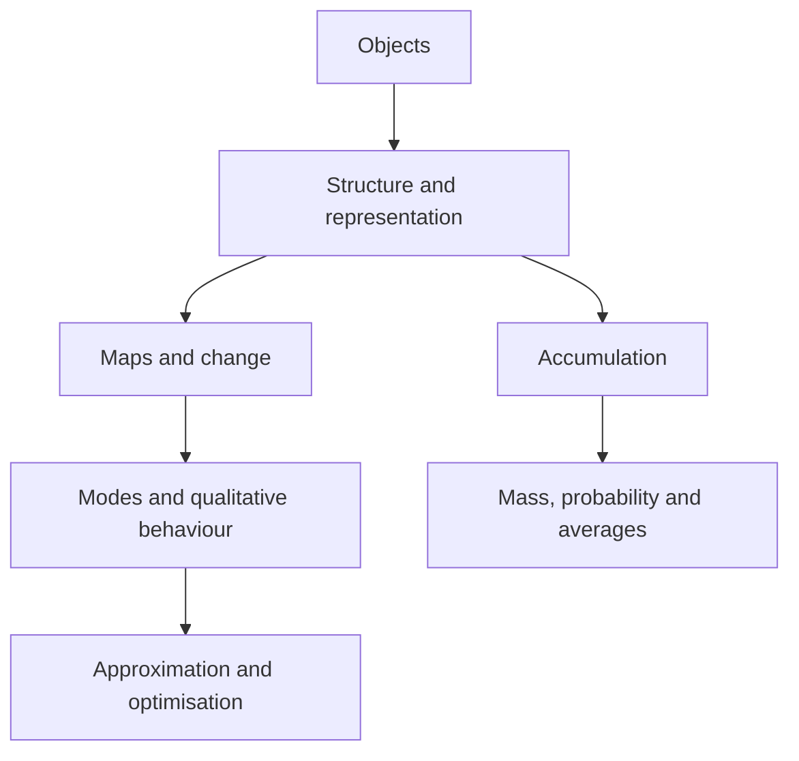

This page helps you find your way around the course. Read it once for an
overview, then come back to the reading paths when a chapter uses a term you
have not met. The ideas linking the two strands are set out on the [Core
page](/core).

## Questions to ask of a new term

When a new term appears, work out which of these questions it answers.

1. **What kind of object is it?** A number, vector, matrix, polynomial,
   function, sequence, series, region or probability distribution. A *space*
   is a collection of objects with enough shared structure to be treated
   uniformly.
2. **What operations are available?** Addition, scalar multiplication,
   composition, differentiation, integration, limits or applying a matrix. The
   operations decide which questions make sense. A vector space, for example,
   is defined by how its addition and scalar multiplication behave, not by
   drawing arrows.
3. **What problem is being solved?** Most problems in the course do one of
   the following:
   - represent an object in coordinates;
   - solve an equation or system;
   - describe how a state evolves;
   - approximate a hard object by a simpler one;
   - optimise a quantity subject to conditions;
   - accumulate a density over an interval or region.
4. **Which representation makes it simple?** Complex numbers have Cartesian,
   polar and exponential forms. A vector can be drawn or given coordinates in
   a basis. A linear map can be written as a formula or a matrix. A planar
   region can be described in Cartesian or polar coordinates. Changing the
   representation leaves the object unchanged but changes which calculations
   are easy.
5. **What assumptions make the claim valid?** Linearity, continuity,
   differentiability, positivity, independence, invertibility, distinct points
   and bounds on a region are not decoration. They are the conditions under
   which a conclusion is guaranteed.
6. **What kind of conclusion is it?** An exact formula, existence without a
   formula, uniqueness, a qualitative description such as growth, decay or
   stability, an approximation with an error bound, or a numerical estimate
   whose accuracy depends on a step size or truncation. These differ in
   strength: knowing that a solution exists is not the same as being able to
   write it down.

## The course in one picture

- **Objects:** numbers, vectors, matrices, polynomials, functions, sequences
  and regions.
- **Structure and representation:** linear combinations, bases, coordinates,
  polar form and changes of variable.
- **Maps and change:** linear transformations, differentiation, recurrences,
  ODEs and matrix evolution.
- **Modes and qualitative behaviour:** eigenvalues, characteristic roots and
  stability.
- **Approximation and optimisation:** Taylor models, numerical methods,
  gradients, Hessians and constraints.
- **Accumulation:** integrals and double integrals, applied to mass,
  probability and averages.

The arrows show recurring dependencies, not a fixed teaching order. Taylor
polynomials, for example, are at once vectors in a polynomial space, local
approximations to functions and tools for numerical computation.

## Reading paths

### Algebra

1. [Vectors and scalars](/algebra/vector-spaces/vector-spaces)
2. [Linear combinations and span](/algebra/vector-spaces/spans)
3. [Linear independence](/algebra/vector-spaces/linear-independence)
4. [Basis and dimension](/algebra/vector-spaces/basis-and-dimension), then
   [coordinates](/algebra/vector-spaces/coordinates-and-bases)
5. [Linear transformations](/algebra/linear-transformations/linear-transformations)
6. [Kernel, image, rank and nullity](/algebra/linear-transformations/kernel-image-rank)
7. [Matrix representations](/algebra/linear-transformations/matrix-representations)
8. [Eigenvalues](/algebra/eigenvalues/eigenvalues-and-eigenvectors) and
   [diagonalisation](/algebra/eigenvalues/diagonalisation)
9. [Matrix dynamics](/algebra/eigenvalues/spectral-applications) and [ODE
   systems](/algebra/eigenvalues/linear-ode-systems)

The chapters follow this order: [complex numbers](/algebra/complex-numbers)
supplies the complex scalars, then [vector spaces](/algebra/vector-spaces),
[linear transformations](/algebra/linear-transformations) and
[eigenvalues](/algebra/eigenvalues).

### Calculus

Everything starts from functions, variables and derivatives, then splits into
three lines that can be read as each becomes relevant.

- **Integration:** antiderivatives and definite integrals, then [integration
  techniques](/calculus/integration-techniques), then [double integrals and
  changes of variables](/calculus/double-integrals).
- **[Differential equations](/calculus/ordinary-differential-equations):**
  [initial data and solution
  families](/calculus/ordinary-differential-equations/ode-fundamentals),
  [first-order methods](/calculus/ordinary-differential-equations/first-order-equations)
  and [models](/calculus/ordinary-differential-equations/first-order-modelling),
  [second-order modes and
  forcing](/calculus/ordinary-differential-equations/second-order-constant-coefficient-equations),
  [existence, uniqueness and Lipschitz
  conditions](/calculus/ordinary-differential-equations/existence-uniqueness-and-linear-operators),
  then [numerical methods and error
  estimates](/calculus/ordinary-differential-equations/numerical-solutions).
- **[Local approximation](/calculus/taylor-series):** [Taylor
  polynomials](/calculus/taylor-series/taylor-polynomials) and their
  [remainders](/calculus/taylor-series/taylors-theorem), [sequences](/calculus/taylor-series/sequences-and-limits)
  and [series](/calculus/taylor-series/infinite-series), then [gradients,
  Hessians and optimisation](/calculus/functions-of-several-variables).

### Notation

If the notation is the main obstacle, start with [mathematical
language](/core/mathematical-language). Return to it whenever two
similar-looking terms start to blur together.
